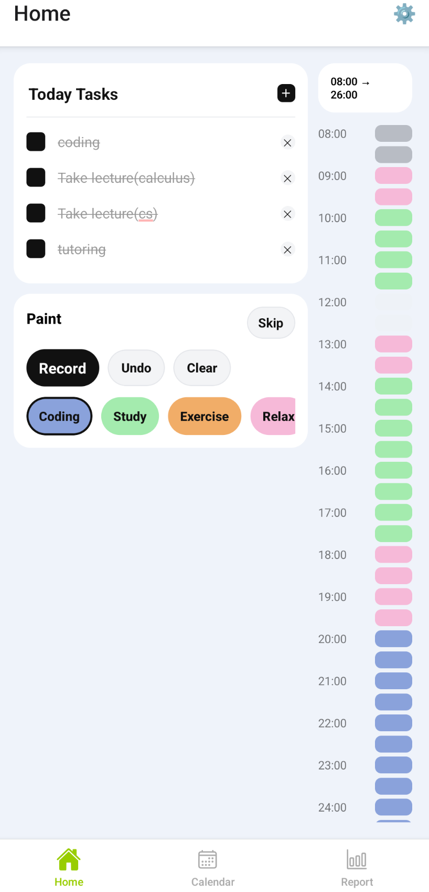
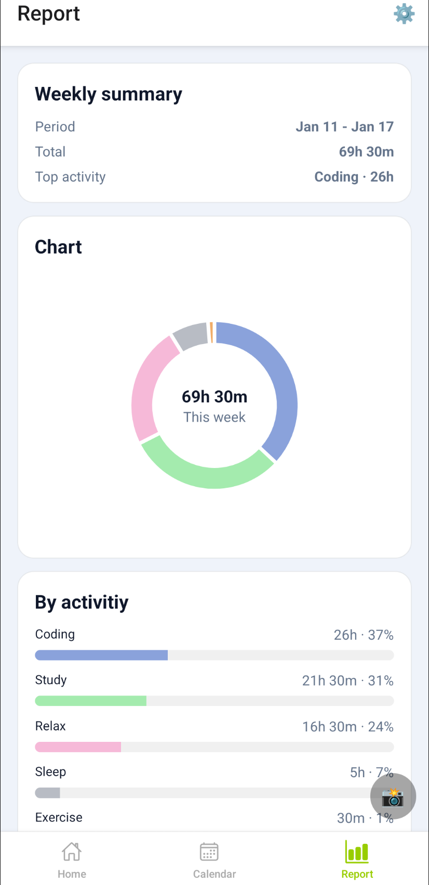
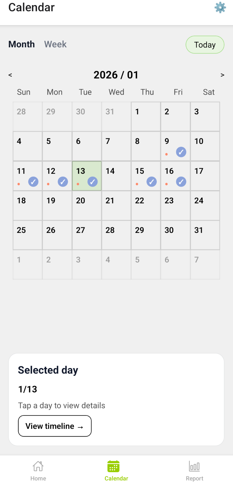
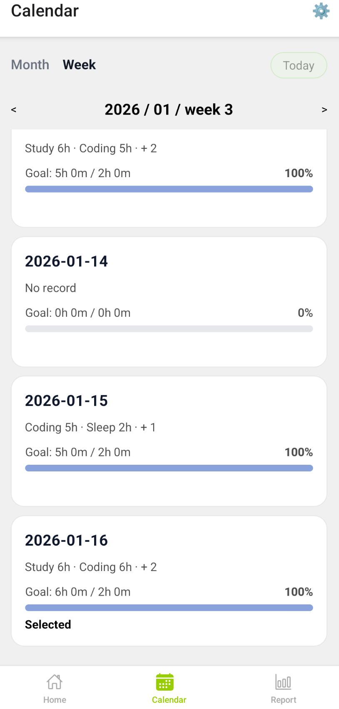

# Seize the Day
A lightweight time-block based daily tracking app built with React Native + Expo.

## Screenshots
<table>
  <tr>
    <td></td>
    <td></td>
  </tr>
  <tr>
    <td></td>
    <td></td>
  </tr>
</table>

## Features
- 30-minute time blocks(customizable)
- Drag-to-paint activity tracking
- Weekly report with charts
- Daily & weekly reminders
- Offline-first(AsyncStorage)
- Simple weekly goals

## Tech Stack
- React Native(Expo)
- TypeScript
- expo-router
- AsyncStorage
- victory-nativeW